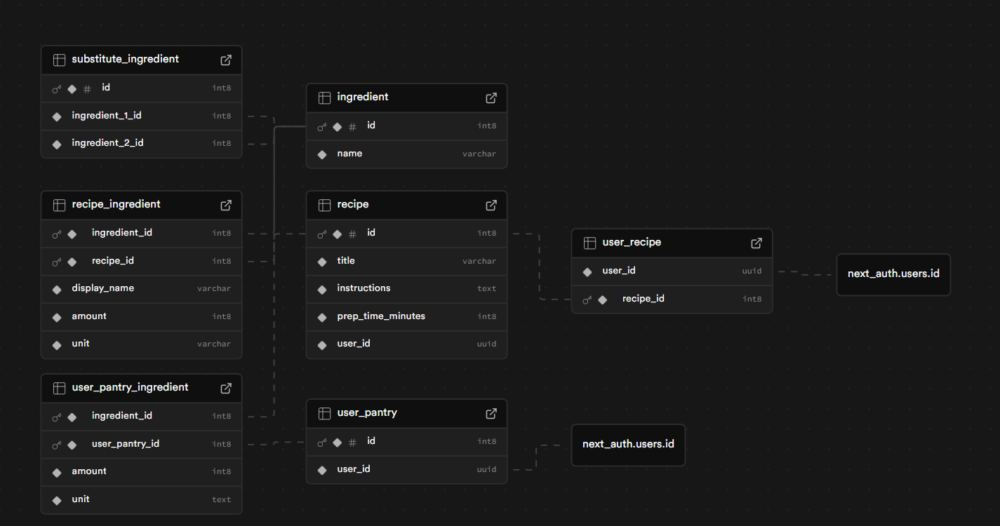

# FlavorForge Final Report

## Creators
- Ben Madsen
- Kyle Mak

## Summary
We decided to create an application which utilizes ingredients that the user has at home. After a list of ingredients is placed into the system, they can find recipes that use those ingredients. This is an easy way to discover new foods and dishes from different cultures.

## Visuals

### Demo Video
<video controls src="media/demo.mp4" title="Title"></video>
### Database ERD

## Learnings
The whole goal of this project was to learn a new framework that was unfamilar to the both of us (Kyle and Ben). We wanted to make something cool while learning Next.js. We both already had experience in C# and .Net so after a brief discussion, we decided to create something using Next.js. As the creation process commenced, we ran into a couple of problems. One of the new things that we encountered was how Next.js decided routing using the file pathing of the project. This was a bit difficult to adjust to in the beginning, but became quite useful later. We also tried using Next Auth which is a library based on authentication. This was especially difficult due to the documentation being out of date. It took a lot of googling and asking ai to figure out the correct procedure to get this to work. 

Another interesting thing we learned was how easily you can make quick web applications which include both a front and backend using just Next.js. Not having to build two separate applications and the easy handling of swapping between client and server rendering make Next.js a good option for quickly getting a minimum viable product. Especially coupled with vercel and supabase.

Key Learnings:
- Next.js framework
- Connecting Supabase to Application
- Authentication with NextAuth

## Usages of AI
### Direct AI implementation
We did not incoperate AI diretly into our application. We had planned to, but we never got that far. The plan was to have connect our application with AI and have it normalize the ingredient names that each user input. We were also planning on having AI generate recipe suggestions to the user. Given more time, we would have been able to implement this.

### AI Consultation
We asked AI for help with these things:
- Outdated docs for Next.js
- Planning out the ERD
- Finding issues using the vscode integrated copilot

## Why
### Kyle Mak
I was interested in the project, mainly due to its direct application to me. I would always come home, open the fridge, and wonder what I should make for dinner. It would take forever to decide on what to make and some of the time, I would not have all the necessary ingredients. This project would be the answer to that issue. It would allow me to be able to find recipes that I already had all the ingredients for. I would no longer have to wonder about what I should make for dinner. Also, learning a new framework that used react was something on my todo list.

## Ben Madsen
I thought this was interesting because of how easy it was to create an application with an appealing user interface, reasonable UX (capable of adjusting to different devices), and able to run in a scalable environment. It helped me understand how people are able to test out SaaS business ideas without significant time commitment. The idea of being able to quickly find recipes based on ingredients I normally have on hand was also just a product I would personally like to have.
